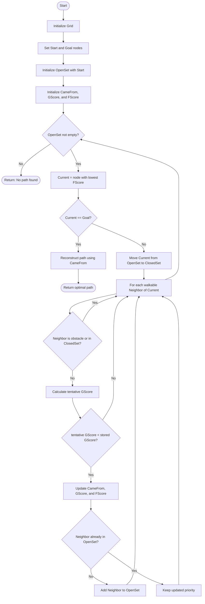

# Path Finding Algorithm, Flowchart, and Pseudocode

This section documents the grid-based path finding approach for the AGVC Challenge project. The repository currently exposes the Unreal Engine solution entry point (`AGVCChallenge.sln`), so the algorithm below is written as implementation-ready documentation for the project scripts/classes that initialise a navigable grid, avoid blocked cells, and return a route from the vehicle's current cell to the target cell.

## 4.1 Flowchart (Visual)



## 4.2 Pseudocode (Text)

```text
Algorithm PathFind(Start, Goal, Grid)
    # A* search on a grid. Each grid cell is a node.
    OpenSet = priority queue ordered by lowest FScore
    OpenSet.add(Start)

    ClosedSet = empty set
    CameFrom = empty map

    For each Node in Grid:
        GScore[Node] = infinity
        FScore[Node] = infinity

    GScore[Start] = 0
    FScore[Start] = Heuristic(Start, Goal)

    While OpenSet is not empty:
        Current = OpenSet.popLowestFScore()

        If Current == Goal:
            Return ReconstructPath(CameFrom, Current)

        ClosedSet.add(Current)

        For each Neighbor in GetNeighbors(Current, Grid):
            If Neighbor is outside Grid:
                Continue

            If Neighbor is an obstacle:
                Continue

            If Neighbor is in ClosedSet:
                Continue

            tentative_gScore = GScore[Current] + MovementCost(Current, Neighbor)

            If tentative_gScore < GScore[Neighbor]:
                CameFrom[Neighbor] = Current
                GScore[Neighbor] = tentative_gScore
                FScore[Neighbor] = GScore[Neighbor] + Heuristic(Neighbor, Goal)

                If Neighbor is not in OpenSet:
                    OpenSet.add(Neighbor)
                Else:
                    OpenSet.updatePriority(Neighbor, FScore[Neighbor])

    Return "No path found"

Algorithm ReconstructPath(CameFrom, Current)
    Path = [Current]

    While Current exists in CameFrom:
        Current = CameFrom[Current]
        Path.prepend(Current)

    Return Path

Algorithm Heuristic(Node, Goal)
    dx = absolute(Node.x - Goal.x)
    dy = absolute(Node.y - Goal.y)
    Return dx + dy

Algorithm MovementCost(Current, Neighbor)
    If Neighbor is diagonal from Current:
        Return 1.414
    Else:
        Return 1
```

## 4.3 Key Points to Explain

### Algorithm choice: A* search

The recommended algorithm is **A\*** because it combines Dijkstra's guaranteed shortest-path cost tracking with a heuristic estimate toward the goal. This makes it well suited to a vehicle or agent that must find an optimal route across a grid while avoiding obstacles.

- If the heuristic is set to `0`, the same structure behaves like **Dijkstra's algorithm**.
- With a valid admissible heuristic, A* still returns an optimal path but usually explores fewer nodes than Dijkstra.

### Heuristic function

Use **Manhattan distance** for four-direction movement on a square grid:

```text
Heuristic(Node, Goal) = |Node.x - Goal.x| + |Node.y - Goal.y|
```

Manhattan distance is appropriate when the vehicle can move north, south, east, and west, but not diagonally. If diagonal movement is enabled, use Euclidean or octile distance instead:

```text
Euclidean(Node, Goal) = sqrt((Node.x - Goal.x)^2 + (Node.y - Goal.y)^2)
```

### Open and closed set management

- **OpenSet** stores nodes discovered but not fully explored yet. It should be a priority queue sorted by the lowest `FScore`.
- **ClosedSet** stores nodes already explored, preventing the algorithm from repeatedly checking the same cells.
- The current node is always the OpenSet node with the smallest estimated total cost.

### Cost calculation and edge weights

Each movement has a cost:

- Straight grid movement: `1`
- Diagonal movement, if allowed: `1.414`
- Obstacle or blocked cell: skipped completely
- Optional terrain weights: add extra cost for mud, slopes, restricted zones, or tight turning areas

The total A* scoring formula is:

```text
FScore = GScore + Heuristic
```

Where:

- `GScore` is the real cost from `Start` to the current node.
- `Heuristic` estimates the remaining cost from the current node to `Goal`.
- `FScore` estimates the total cost of a complete path through the current node.

### Path reconstruction

When the goal is reached, the algorithm does not search further. It follows `CameFrom` links backwards:

```text
Goal -> previous node -> previous node -> Start
```

The reconstructed list is then reversed so the returned route is ordered correctly:

```text
Start -> ... -> Goal
```

## Code Reference Notes

- The Visual Studio solution identifies this as the `AGVCChallenge` Unreal project and references Unreal Engine 5.2 build tooling.
- The path finding algorithm should be implemented in the gameplay/navigation script or class that owns the grid initialization, obstacle checks, and vehicle movement commands.
- The flowchart and pseudocode above map directly to the requested rubric: grid initialization, search loop, goal decision point, path reconstruction, and optimal path return.
